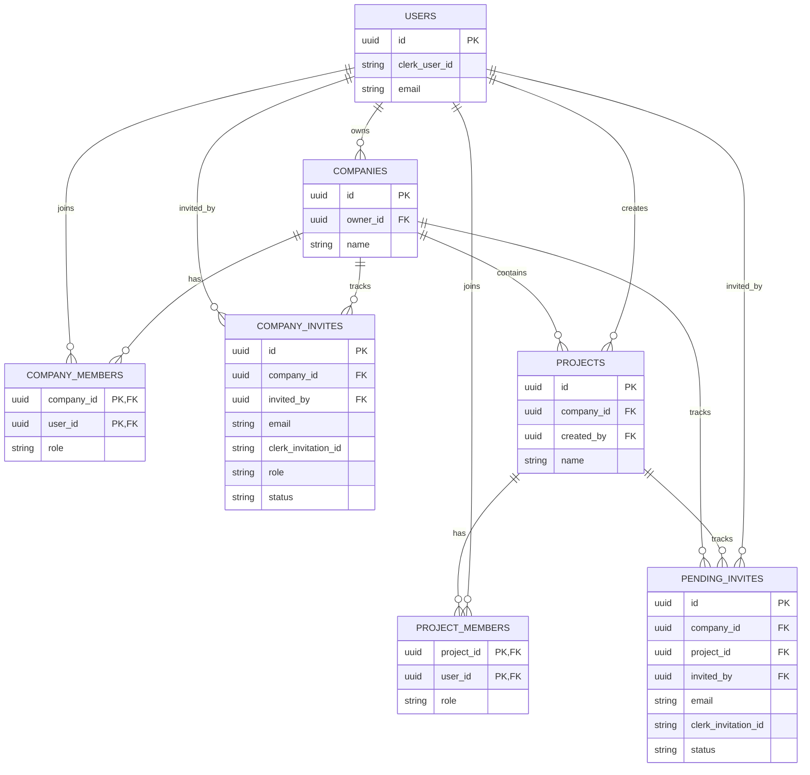

# claimo
Submit, track and approve construction payment claims in one place. From subcontractor to main contractor to client, every claim is visible, traceable and resolved faster.

## Database Relationships

### How To Read It

- `users` is the base auth/profile table for Clerk-backed users.
- `companies.owner_id` points to the user who owns the company.
- `company_members` is the company access table. It tells you which users belong to which company and what their company role is.
- `company_invites` stores company-only invitations and tracks pending, accepted, and revoked state.
- `projects.company_id` points to the company that owns the project.
- `projects.created_by` points to the user who created the project.
- `project_members` is the project access table. It tells you which users can see or work on a specific project and what their project role is.
- `pending_invites` stores invite state before and after Clerk sends the invitation. It links the invite email to the company, project, and inviter.
- `company_invites` and `pending_invites` are separate tables on purpose. One is for company access, the other is for project access.

### Important Rule

- Company membership and project membership are separate.
- Company admins and account owners can see all projects in their company.
- Company members can only see projects they are explicitly added to through `project_members`.
- Project invites are only sent when the user is not already a company member.
- Company invites add the user to the company without adding them to a project.
