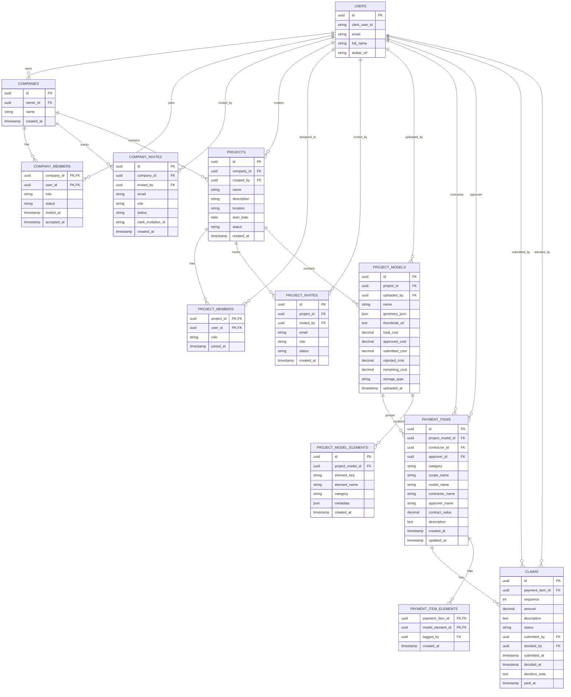

# claimo
Submit, track and approve construction payment claims in one place. From subcontractor to main contractor to client, every claim is visible, traceable and resolved faster.

## Database Architecture

The frontend is still persisting most of this in `sessionStorage` for now, but the data model it already expects is:

- company-level members in settings
- company role and project role are separate
- projects owned by a company
- project members with their own project roles
- uploaded BIM models with thumbnails and geometry JSON
- model-level cost tracking for the whole building or building segment
- payment items attached to a model and to selected geometry elements
- claim history attached to each payment item

### How To Read It

- `users` is the auth/profile table backing Clerk users.
- `companies` is the workspace boundary.
- `company_members` stores company access and company-level `role` for the settings page.
- `projects` are owned by a company and created by a user.
- `project_members` stores who can access each project and what project `role` they have in that project.
- `project_invites` is optional future support for invite-based project onboarding. The current frontend’s project invite modal can also write directly to `project_members`.
- `project_models` stores the uploaded BIM JSON plus the generated thumbnail and the model-level cost totals. For now the JSON model can live in PostgreSQL, while Azure Blob Storage is the future file-storage target.
- `project_model_elements` is the element index for a model. It gives the viewer a stable place to store element IDs and metadata for manual tagging.
- `payment_items` are attached to a single model and point at the assigned contractor and approver. They are repeatable work scopes, so the same category or label can appear more than once for different parts of the model.
- `payment_item_elements` stores the many-to-many link between a payment item and the specific model elements the user tagged in the viewer.
- `claims` is the audit trail for each payment item. Status, sequence, decision note, and payment timestamps all live here.

### Important Rule

- Company membership and project membership are separate.
- Company roles come from `CompanyRole` and only control company-level access.
- Project roles come from `ProjectRole` and only control project-level access.
- Company admins and account owners can see all projects in their company.
- The project detail screen can be served entirely from project, model, payment item, and claim endpoints once those records exist server-side.
- Model storage can start in PostgreSQL as JSON and later move to Azure Blob Storage without changing the project or payment relationships.
- Model totals should be stored or derived at the model level so the whole building or building segment has its own cost tracking.
- Payment item totals should roll up into the model totals, while claims roll up into the payment item totals.
- Derived values like `projectSummary`, `modelSummary`, `itemTotals`, and `derivedStatus` should be computed from the stored records, not duplicated as source-of-truth columns.
